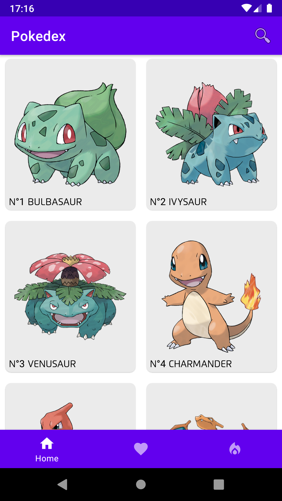
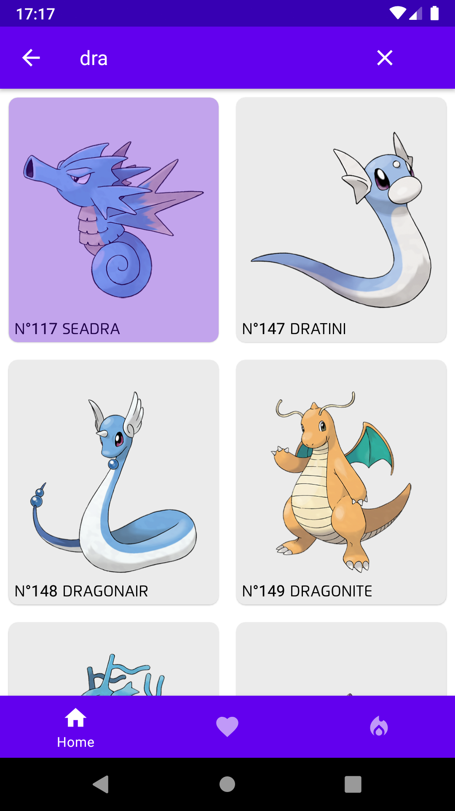
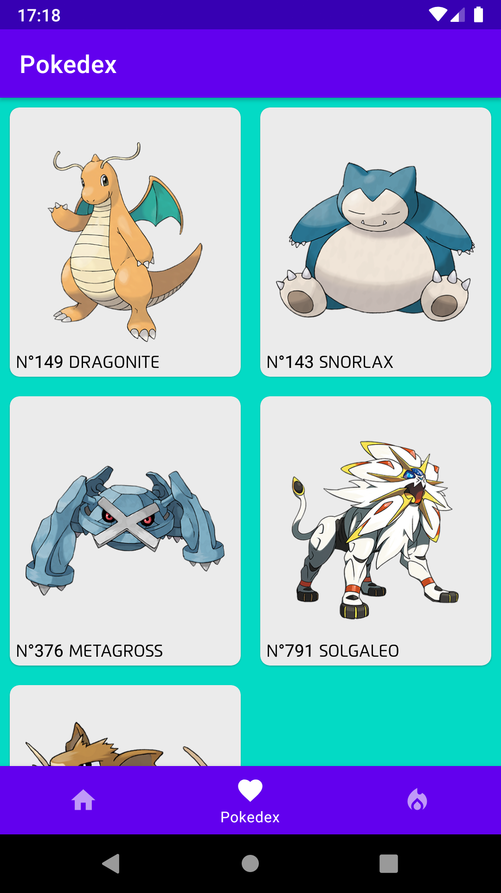
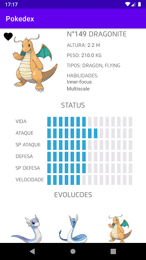

# Pokedex

App criado com base no desafio proposto pela Blu: <a href="https://github.com/Pagnet/desafio-front-android">Link do Desafio</a>. Os dados estão sendo puxados da <a href="https://pokeapi.co/">Pokeapi</a>.  

O app foi idealizado para ser uma pokedex(catálogo de pokemon) 

## Features do app: 

<ul>
  <li>Pesquisa de pokemon</li>
  <li>Adiciona e Exclui pokemon da lista de favoritos</li>
  <li>Exclusão multipla</li>
  <li>Exibe detalhes</li>
  <li>Ao clicar em uma habilidade abre uma janela detalhando-a</li>
  <li>Filtra pokemon por tipos</li>
</ul>

## Bibliotecas usadas:
<ul>
  <li>Retrofit2</li>
  <li>Koin</li>
  <li>Gson</li>
  <li>RecyclerView</li>
  <li>Lifecycle</li>
  <li>Room</li>
  <li>Glide</li>
  <li>Navigation</li>
  
</ul>

   
