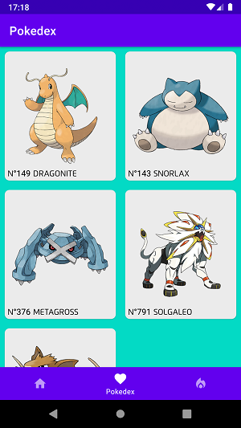

# Pokedex

App criado com base no desafio proposto pela Blu: [Link do Desafio](https://github.com/Pagnet/desafio-front-android) 

Funcionalidades de app: O app foi idealizado para ser uma pokedex(catálogo de pokemon), ele realiza pesquisa de pokemon, adiciona e exclui dos favoritos, exibe detalhes e mais.  

O dados estão sendo puxados da api([Pokeapi](https://pokeapi.co/)) pelo Retrofit, está sendo usado Koin para Injeção de dependência entre classes, ViewModel para MVVM, Room para armazenar os dados locamente, RecyclerView para criação de lista e Navigation para navegar no app.

   
